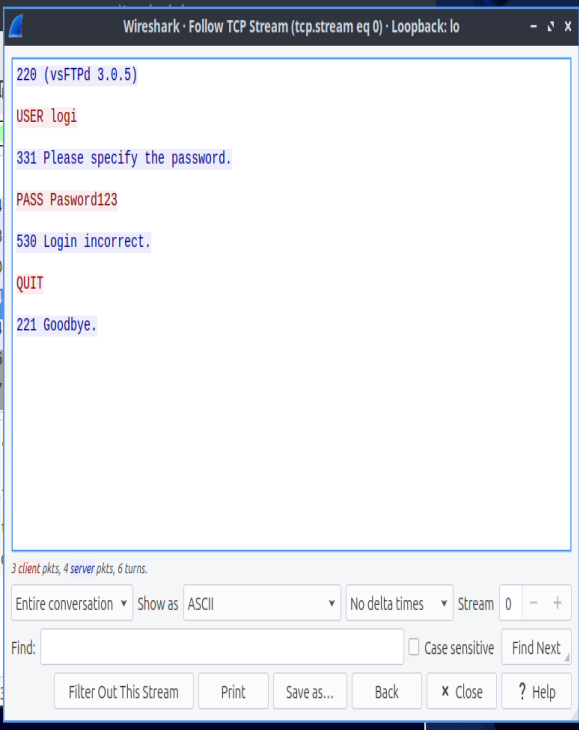
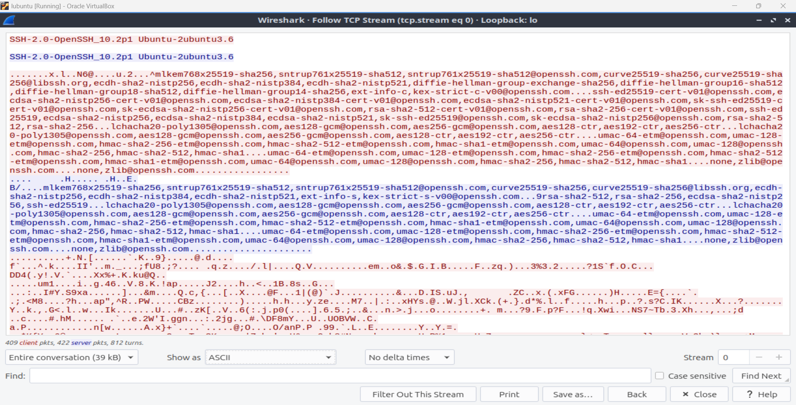
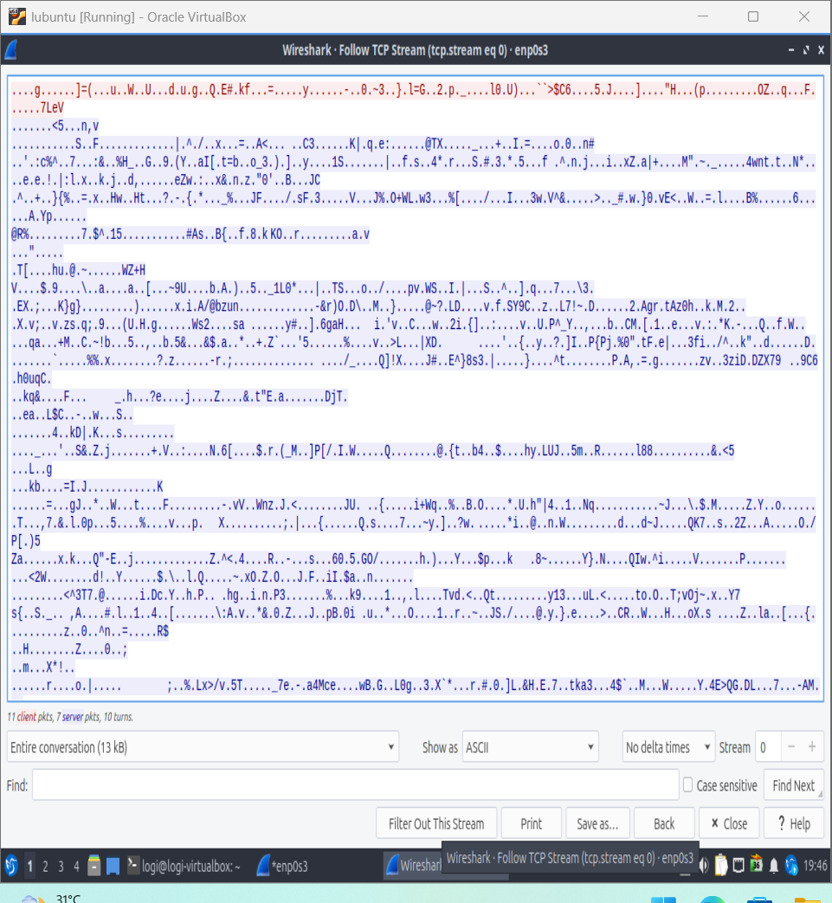
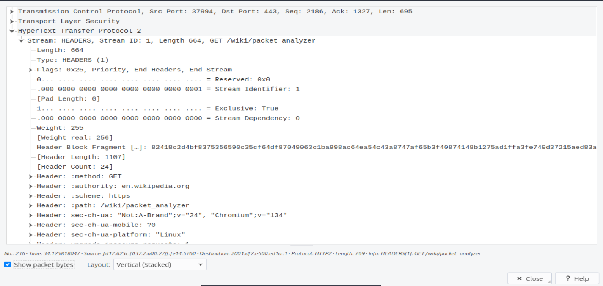

# Cleartext vs Encrypted — A Packet-Level Comparison Lab

Ever wondered what an attacker actually sees when they "capture network traffic"? This lab shows it — packet by packet, in Wireshark, on a local virtual machine. I ran the same kinds of sessions twice: once over cleartext protocols (FTP), once over encrypted ones (SSH, HTTPS), captured both, and compared.

The result is a hands-on demonstration of why protocol choice decides whether your credentials leak.

## Why this matters

Cleartext protocols fail on all three pillars of secure communication:

| Pillar | What cleartext gives an attacker |
| --- | --- |
| Confidentiality | Anyone on the path can read passwords and data off the wire |
| Integrity | A man-in-the-middle can alter data in flight |
| Authenticity | Nothing proves you're talking to the real server, not an impostor |

## Protocol & port map

| Cleartext | Port | Secure counterpart | Port |
| --- | --- | --- | --- |
| HTTP | 80 | HTTPS | 443 |
| Telnet | 23 | SSH | 22 |
| FTP | 21 | FTPS / SFTP | 990 / 22 |
| SMTP | 25 | SMTPS | 587 |
| POP3 | 110 | POP3S | 995 |
| IMAP | 143 | IMAPS | 993 |

## Setup

- Lubuntu (minimal install) in a VirtualBox VM
- `wireshark`, `openssh-server`, `vsftpd`, `falkon`
- All experiments run against `localhost` or the VM's own interface

## Experiment 1 — A password flies by in cleartext (FTP)

**What I did:** started a Wireshark capture on the loopback interface, then attempted a login to the local FTP server (vsftpd) with a deliberately throwaway password.

**Result (Wireshark → Follow TCP Stream):**

```text
220 (vsFTPd 3.0.5)
USER logi
331 Please specify the password.
PASS Pasword123
530 Login incorrect.
QUIT
221 Goodbye.
```

The username, the password, every command — the entire session is readable English.



**Key insight:** even a *rejected* login leaks the password — the server's verdict doesn't un-send the bytes. The packet has already crossed the network before any authentication decision is made.

## Experiment 2 — The same session, encrypted (SSH)

**What I did:** captured an SSH login to the same machine, `ssh logi@localhost`, then ran a few commands and exited.

**Result (Follow TCP Stream):** the only readable text is the protocol banner and the algorithm negotiation:

```text
SSH-2.0-OpenSSH_10.2p1 Ubuntu-2ubuntu3.6
<lists of key-exchange and cipher algorithms>
<then ~39 kB of binary gibberish>
```

No username. No password. No commands. Nothing.



**Key insight:** the readable part is *by design* — both sides must publicly agree on which encryption to use before they can encrypt. Everything sensitive happens after that switch flips.

## Experiment 3 — Decrypting my own HTTPS session (TLS key logging)

**What I did:** launched the browser with TLS session-key logging enabled:

```bash
QTWEBENGINE_CHROMIUM_FLAGS="--ssl-key-log-file=$HOME/ssl-key.log" falkon &
```

Captured my own browsing to Wikipedia, then pointed Wireshark at the key file
(Edit → Preferences → Protocols → TLS → (Pre)-Master-Secret log filename) and re-dissected the capture.

**Result:** with the keys, the traffic decrypts into HTTP/2, and the packet dissection shows my own request:

```text
:method: GET
:authority: en.wikipedia.org
:path: /wiki/Packet_analyzer
```

Without the keys, the same packets show only "Application Data" over TLS.




**Key insight:** encryption is key management, not magic. Whoever holds the session keys reads the traffic — which is why this works on my own capture and does nothing against anyone else's. It also demonstrates *why* key hygiene matters: leaking a key file is equivalent to leaking the plaintext.

Note: over HTTP/2, even decrypted traffic needs a proper dissector to read (headers are HPACK-compressed), so the readable content appears in the packet details rather than the raw TCP stream.

## Lessons

1. **Cleartext protocols leak everything, always** — including failed logins.
2. **SSH's design is instructive** — the open handshake (choose ciphers) followed by total encryption of everything sensitive.
3. **TLS is only as strong as key custody** — with the keys, "encrypted" becomes "readable"; without them, it stays noise.
4. Wireshark + `Follow TCP Stream` is one of the fastest ways to audit what a protocol is really sending.

## Reproducing it

```bash
sudo apt install wireshark openssh-server vsftpd falkon
sudo usermod -aG wireshark $USER   # then log out and back in

# FTP (cleartext demo)
sudo systemctl start vsftpd
# capture on "lo" in Wireshark, then:
ftp localhost

# SSH (encrypted demo)
sudo systemctl start ssh
# capture on "lo" in Wireshark, then:
ssh <your-user>@localhost

# HTTPS (key-logging demo)
QTWEBENGINE_CHROMIUM_FLAGS="--ssl-key-log-file=$HOME/ssl-key.log" falkon &
# capture on your main interface, browse anywhere, then load the key file
# in Wireshark's TLS preferences
```
